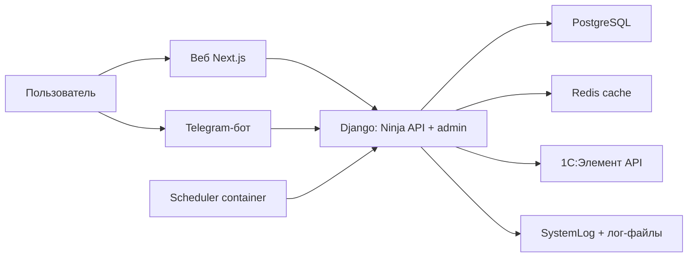

# Next-Refuels — архитектура

## Обзор

`Next-Refuels` — корпоративная система учёта заправок автопарка. Платформа
состоит из:

- веб-клиента на Next.js (`frontend/`: ввод, отчёты, аналитика);
- backend на Django (Ninja API, админка, часть legacy-страниц при наличии);
- Telegram-бота для оперативного ввода заправок;
- фонового scheduler (синхронизация автопарка из `1C:Элемент`);

Архитектура построена вокруг единых доменных сущностей и сервисного слоя
(`core/services`), чтобы одинаковая бизнес-логика применялась и в вебе, и
в боте.

## Границы системы (C4 - упрощенно)

### Контекст

### Компоненты

- `frontend/` — основной веб-клиент на Next.js (ввод, отчёты, аналитика,
  прокси к API при пустом `NEXT_PUBLIC_API_URL`).
- `next_refuels/` — Django project (settings, URLs, ASGI).
- `core/` - доменные сущности, представления и сервисы:
  - `models/`: `User`, `Car`, `Region`, `FuelRecord`, `SystemLog`;
  - `views.py`: серверный рендер и маршруты, дублируемые или не перенесённые
    во фронт (при необходимости);
  - `api.py`: HTTP API контур через `django-ninja`;
  - `refuel_bot/`: Telegram диалоги и middleware доступа;
  - `clients/`: клиенты внешних API (`element_car_client.py`);
  - `services/`: бизнес-логика и интеграции (например, `fuel_service`).
  - `management/commands/`: команды синхронизации.
- `docker-compose*.yml`:
  - `web`: backend;
  - `bot`: Telegram bot;
  - `scheduler`: периодический запуск синка автопарка;
  - `nginx/templates/`: reverse proxy и SSL (prod), подстановка `DOMAIN` при старте.

## Основные сценарии и потоки данных

### 1. Ввод заправки через веб

1. Пользователь открывает `/fuel/add/`.
2. Django view получает `car`, `liters`, `source` и формирует payload.
3. `FuelService.normalize_liters` валидирует и нормализует объем.
4. `FuelService.create_fuel_record`:
   - проверяет, что `Car` активна;
   - создает `FuelRecord` в БД.
5. Запись доступна в отчетах (`/fuel/reports/` и API `/reports/*`).

### 2. Ввод заправки через Telegram

1. `ConversationHandler` ведет пошаговый диалог (госномер -> литры -> способ).
2. `core/refuel_bot/middleware/access_middleware.py`:
   - связывает Telegram user с `core.User` по одноразовому коду из `/start`
     или `/link`;
   - проверяет наличие активного пользователя и групп доступа;
   - кэширует профиль на 15 минут (ключ `bot_user:<telegram_id>`).
3. После успешного ввода вызывается `FuelService.create_fuel_record`.
4. Созданная запись доступна в отчетах.

### 3. Синхронизация автомобилей из `1C:Элемент`

1. Scheduler запускает `python manage.py sync_cars_with_element`.
2. Команда использует `ElementCarClient.sync_with_database()`:
   - получает данные с внешнего API;
   - маппит внешние сущности в внутренние `Region`/`Car`;
   - архивирует отсутствующие автомобили (если настроено в логике клиента);
   - пишет итоги синхронизации в `SystemLog`.
3. Ошибки синхронизации логируются и не “роняют” контейнер (в зависимости
   от сценария запуска).

## Доменные сущности (ключевые поля)

- `User`: пользователь Django, содержит `telegram_id` и FK на `Region`.
- `Car`: автомобиль компании, связан с `Region` и помечается активным/архивным.
- `FuelRecord`: факт заправки, содержит объем, топливо, источник, статус
  подтверждения и ссылки на `Car` и сотрудника (`User`).
- `SystemLog`: аудит пользовательских и системных событий.

## Навигация и привязка Telegram (web)

- Фронтенд получает состояние привязки из `GET /api/v1/auth/me` через поле
  `telegram_linked`.
- В меню (desktop + mobile) пункт `Бот` показывается только если у пользователя
  роль из input-доступа (`Заправщик`, `Менеджер`, `Администратор`) и
  `telegram_linked=false`.
- Пункт `Доступ` показывается только ролям `Менеджер` и `Администратор`.
  Для `Заправщик` этот пункт скрыт.
- Экран self-service привязки вынесен в отдельный маршрут `/bot`.
- При активации/деактивации пользователя backend очищает кэш Telegram middleware
  `bot_user:<telegram_id>`, чтобы бот сразу учитывал новый `is_active`.

## Аналитика (раздел «Аналитика» во фронтенде)

Данные отдаёт API `GET /api/v1/analytics/stats` (доступ у ролей с правами
отчётов). Ниже — как интерпретировать блоки дашборда после актуальной логики.

### Топливозаправщики в справочнике автомобилей

У модели `Car` есть флаг **`is_fuel_tanker`** («Топливозаправщик»):

- задаётся в админке Django;
- миграция `0015_car_is_fuel_tanker` при применении проставляет флаг
  записям, у которых в поле модели есть подстрока `Caddy` (типичный кейс);
- дальше список корректируется вручную при необходимости.

### «Распределение по источникам заправки»

Поле ответа: **`refuel_sources`**.

- Учитываются **только** записи со способом **топливная карта** и
  **Telegram-бот** (`source=CARD` и `source=TGBOT`).
- Записи со способом **«Топливозаправщик»** (`TRUCK`) **в этот график не
  входят**.
- Топливозаправщики здесь **не выделяются**: их заправки картой и ботом
  считаются вместе с остальным парком в тех же двух секторах.

### Единый срез дашборда (кроме «Распределение по источникам»)

Для согласованных KPI и графиков на фронтенде backend строит один и тот же
набор записей **`FuelRecord`** (после фильтров по дате и региону в запросе):

- способ **карта** или **бот**, и при этом получатель **не** помечен как
  топливозаправщик: `source ∈ {CARD, TGBOT}` и `car.is_fuel_tanker=False`;
- **или** способ **«Топливозаправщик»**: `source=TRUCK` — **для любого**
  получателя в поле `car`, в том числе если `car.is_fuel_tanker=True`
  (выдача на топливозаправщик учитывается в срезе TRUCK).

В коде этот фильтр собран в **`core.api._analytics_dashboard_channel_records_qs`**.

Записи без привязанного автомобиля в срез по `car__is_fuel_tanker` не попадают.

### «Карта, Telegram-бот и топливозаправщик»

Поле ответа: **`refuel_channels`** (три среза: CARD, TGBOT, TRUCK) — агрегаты
по описанному выше срезу.

- **Карта** и **бот** — только не-топливозаправщики как получатели.
- **Топливозаправщик** (`TRUCK`) — все записи этого способа, включая выдачу
  **на** топливозаправщик.
- Самозаправ топливозаправщиков **картой/ботом** в этот блок **не входит**
  (как и раньше: такие строки отфильтровываются условием по `is_fuel_tanker`
  для CARD/TGBOT).

### «Объём по дням» и «Объём по дням и регионам»

Поля ответа: **`by_day`**, **`by_day_region`**.

- Сумма литров по дням/регионам считается **по тому же срезу**, что и
  `refuel_channels` (исторический регион — `historical_region` записи).
- Сумма точек `by_day` за период совпадает с суммой литров по трём каналам
  и с KPI «Всего литров» на дашборде.

### Топ-20 по сотрудникам и по автомобилям

- **Топ сотрудников** (поле `by_employee`) — объём **только по записям из того же
  среза**, что `refuel_channels` (см. выше); сортировка по убыванию литров;
  на графиках разрядная группировка (локаль `ru-RU`).
- **Топ автомобилей по объёму** (поле `by_car`) — **без** машин с
  `is_fuel_tanker=True`, по **всем** записям этих машин (полный набор записей
  после фильтров даты/региона в запросе, не только срез дашборда).
- Отдельная карточка **«Топливозаправщики по объёму»** (поле
  `by_car_fuel_tankers`) — только машины с `is_fuel_tanker=True`, также по
  полному отфильтрованному набору записей за период.

## Наблюдаемость

- Health endpoint backend: `/health/` (используется Docker healthcheck).
- Логирование:
  - `SystemLog` (структурированный аудит);
  - общий log-файл через Django logging конфиг.

