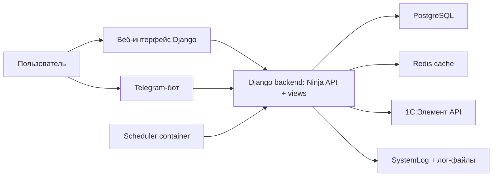

# Next-Refuels — архитектура

## Обзор

`Next-Refuels` — корпоративная система учёта заправок автопарка. Платформа
состоит из:

- веб-приложения на Django (ввод заправок, отчеты, админка);
- Telegram-бота для оперативного ввода заправок;
- фонового scheduler (синхронизация автопарка из `1C:Элемент`);

Архитектура построена вокруг единых доменных сущностей и сервисного слоя
(`core/services`), чтобы одинаковая бизнес-логика применялась и в вебе, и
в боте.

## Границы системы (C4 - упрощенно)

### Контекст

### Компоненты

- `frontend/` — веб-клиент на Next.js для ввода и аналитики.
- `next_refuels/` — Django project (settings, URLs, ASGI).
- `core/` - доменные сущности, представления и сервисы:
  - `models/`: `User`, `Car`, `Region`, `FuelRecord`, `SystemLog`;
  - `views.py`: веб-страницы (`/`, `/fuel/add/`, `/fuel/reports/`, ...);
  - `api.py`: HTTP API контур через `django-ninja`;
  - `refuel_bot/`: Telegram диалоги и middleware доступа;
  - `clients/`: клиенты внешних API (`element_car_client.py`);
  - `services/`: бизнес-логика и интеграции (например, `fuel_service`).
  - `management/commands/`: команды синхронизации.
- `docker-compose*.yml`:
  - `web`: backend;
  - `bot`: Telegram bot;
  - `scheduler`: периодический запуск синка автопарка;
  - `nginx/templates/`: reverse proxy и SSL (prod), подстановка `DOMAIN` при старте.

## Основные сценарии и потоки данных

### 1. Ввод заправки через веб

1. Пользователь открывает `/fuel/add/`.
2. Django view получает `car`, `liters`, `source` и формирует payload.
3. `FuelService.normalize_liters` валидирует и нормализует объем.
4. `FuelService.create_fuel_record`:
   - проверяет, что `Car` активна;
   - создает `FuelRecord` в БД.
5. Запись доступна в отчетах (`/fuel/reports/` и API `/reports/*`).

### 2. Ввод заправки через Telegram

1. `ConversationHandler` ведет пошаговый диалог (госномер -> литры -> способ).
2. `core/refuel_bot/middleware/access_middleware.py`:
   - связывает Telegram user с `core.User` по одноразовому коду из `/start`
     или `/link`;
   - проверяет наличие активного пользователя и групп доступа;
   - кэширует профиль на 15 минут (ключ `bot_user:<telegram_id>`).
3. После успешного ввода вызывается `FuelService.create_fuel_record`.
4. Созданная запись доступна в отчетах.

### 3. Синхронизация автомобилей из `1C:Элемент`

1. Scheduler запускает `python manage.py sync_cars_with_element`.
2. Команда использует `ElementCarClient.sync_with_database()`:
   - получает данные с внешнего API;
   - маппит внешние сущности в внутренние `Region`/`Car`;
   - архивирует отсутствующие автомобили (если настроено в логике клиента);
   - пишет итоги синхронизации в `SystemLog`.
3. Ошибки синхронизации логируются и не “роняют” контейнер (в зависимости
   от сценария запуска).

## Доменные сущности (ключевые поля)

- `User`: пользователь Django, содержит `telegram_id` и FK на `Region`.
- `Car`: автомобиль компании, связан с `Region` и помечается активным/архивным.
- `FuelRecord`: факт заправки, содержит объем, топливо, источник, статус
  подтверждения и ссылки на `Car` и сотрудника (`User`).
- `SystemLog`: аудит пользовательских и системных событий.

## Аналитика (раздел «Аналитика» во фронтенде)

Данные отдаёт API `GET /api/v1/analytics/stats` (доступ у ролей с правами
отчётов). Ниже — как интерпретировать блоки дашборда после актуальной логики.

### Топливозаправщики в справочнике автомобилей

У модели `Car` есть флаг **`is_fuel_tanker`** («Топливозаправщик»):

- задаётся в админке Django;
- миграция `0015_car_is_fuel_tanker` при применении проставляет флаг
  записям, у которых в поле модели есть подстрока `Caddy` (типичный кейс);
- дальше список корректируется вручную при необходимости.

### «Распределение по источникам заправки»

Поле ответа: **`refuel_sources`**.

- Учитываются **только** записи со способом **топливная карта** и
  **Telegram-бот** (`source=CARD` и `source=TGBOT`).
- Записи со способом **«Топливозаправщик»** (`TRUCK`) **в этот график не
  входят**.
- Топливозаправщики здесь **не выделяются**: их заправки картой и ботом
  считаются вместе с остальным парком в тех же двух секторах.

### «Карта, Telegram-бот и топливозаправщик»

Поле ответа: **`refuel_channels`** (три среза: CARD, TGBOT, TRUCK).

- Во **всех** трёх срезах учитываются **только** заправки на автомобили **без**
  флага топливозаправщика: `car.is_fuel_tanker=False` (записи без привязанного
  автомобиля сюда не попадают).
- **Карта** и **бот** — заправки не-топливозаправщиков соответствующим способом.
- **Топливозаправщик** (`TRUCK`) — выдача топлива с бензовоза **на другие**
  машины (в записи в поле `car` указан получатель, не являющийся
  топливозаправщиком).
- Самозаправ самих топливозаправщиков (карта/бот на `car` с
  `is_fuel_tanker=True`) в этом блоке **не учитывается**.

### Топ-20 по сотрудникам и по автомобилям

- **Топ сотрудников** — по убыванию объёма; числа на графиках с группировкой
  разрядов (локаль `ru-RU`).
- **Топ автомобилей по объёму** — **без** машин с `is_fuel_tanker=True`
  (поле **`by_car`**).
- Отдельная карточка **«Топливозаправщики по объёму»** — только машины с
  `is_fuel_tanker=True` (поле **`by_car_fuel_tankers`**).

## Наблюдаемость

- Health endpoint backend: `/health/` (используется Docker healthcheck).
- Логирование:
  - `SystemLog` (структурированный аудит);
  - общий log-файл через Django logging конфиг.

